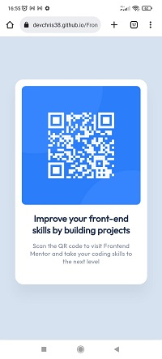

# Frontend Mentor - QR code component solution

Voici une solution de l'exercice [QR code component challenge sur Frontend Mentor](https://www.frontendmentor.io/challenges/qr-code-component-iux_sIO_H).


## Apperçu du projet

### Capture d'écran



### Lien

[Live Site](https://devchris38.github.io/Frontend-Mentor-challenge-QR-code-component/)

## Mon process

### Construit avec

- HTML5 / CSS3 vanilla
- Un tout petit peu de Flexbox

### Ce que ce projet m'a appris

C'est mon tout premier projet de site web, il est très simple, mais il m'a permis de mettre en oeuvre une partie de ce que j'ai appris en HTML5/CSS3.

Cela m'a par exemple permis d'utiliser un tout petit peu de flexbox pour centrer la zone principal en appliquant le code suivant au bloc parent, c'est à dire le body

```css
display: flex;
    align-items: center;
```
